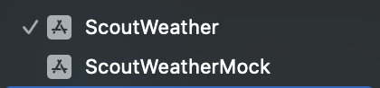
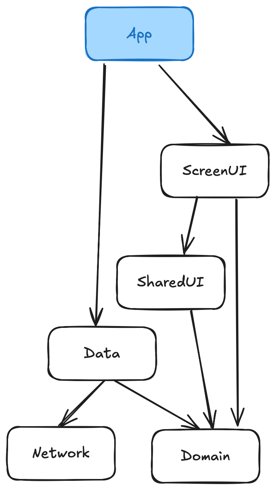

# ScoutWeather

This is a take home project submission for an interview.

## Setup

Clone the project and wait for swift package dependencies to resolve.

### Schemes

Upon opening the Xcode project, you will notice two schemes to run.

`ScoutWeatherMock` - runs the app with mock services that allows you to experience the app WITHOUT network connectivity.

`ScoutWeather` - runs the app with real services that allows you to experience the app WITH network connectivity. **This requires additional setup.** Enter a WeatherAPI key in the file `WeatherAPIConfig.plist` under the entry `API_KEY`.

## Dependencies

### 3rd Party

#### [Nuke](https://github.com/kean/Nuke)
Nuke is a fantastic image loading / display library. Its simple to use, performs caching, is efficient, and has great documentation. I have used it in one professional app and continue to return to it whenever possible.

### Personal

#### [AmpleDependency](https://github.com/CarlFunk/AmpleDependency)
A singleton container + property wrapper implementation with the ability to request ephemeral or singleton instances of a dependency at runtime and inline.

#### [AmpleMock](https://github.com/CarlFunk/AmpleMock)
A mocking library that aids in providing mock definitions with type safety that can be implemented quickly. Modifying a mock to provide a change in value is very easy inline where needed.

#### [AmpleNavigation](https://github.com/CarlFunk/AmpleNavigation)
A navigation library that makes working with a navigation stack in an easy manner. It provides an interface that might seem familiar coming from UIKit background.

## App

The app follows principles of Clean Architecture, Modular Architecture, Reactive Programming, MVVM-C, and ViewState, without falling all the way into one paradigm. I would love to review the overall project with you and explain my thoughts on what motivated decisions in its design.

Here's a short graphic to roughly explain the downward flow of package dependencies. 

